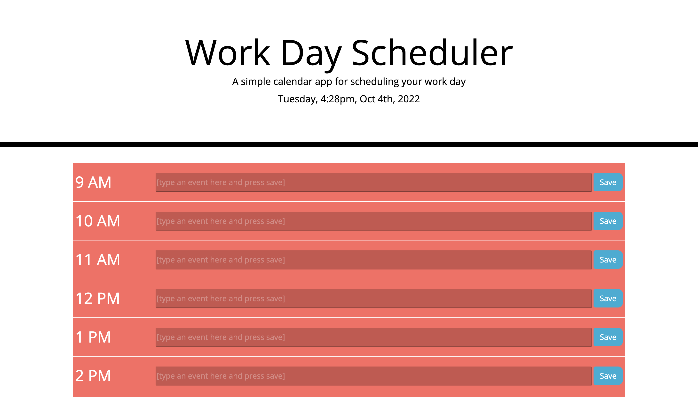

# challenge05-SimplePlanner

## Description

This repository holds the code for a simple daily planner that applies to the standard business hours of 9-5. This project was created as an exercise in javascript and APIs.
I learned how to pull apart data from strings to reference other elements on the page through consistent naming conventions.

## Installation

N/A

## Usage

To use the scheduler, simply type in the boxes correlating to the time slot and press 'save'. When reloading the page, your text will appear in that box.
Simply write something new to replace your text. The planner has a color-based system for letting the user know if that time slot is: 
in the past(red), in the present(yellow), or in the furure(green). 

## Credits

N/A

## License

reference LICENSE in the repo
